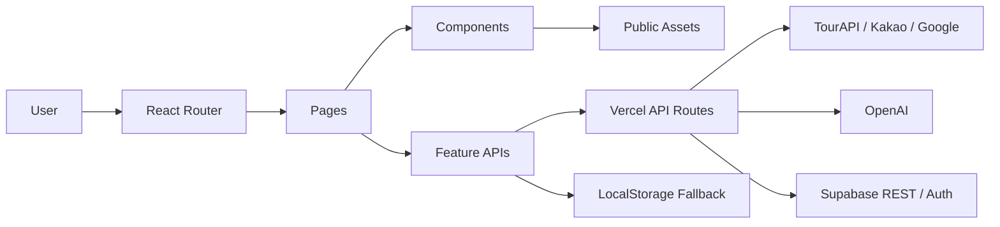

# 영주선비길

<div align="center">
  
  <br />

  ### - 영주선비길 -
  #### 선비 유형 테스트와 영주 관광 데이터를 연결하는 AI 코스 추천 플랫폼
  <br />

  <kbd>React</kbd>
  <kbd>TypeScript</kbd>
  <kbd>Vite</kbd>
  <kbd>Vercel Functions</kbd>
  <kbd>Supabase</kbd>
  <kbd>OpenAI</kbd>
</div>

<br />

## Deployment

- Frontend: 배포 환경에서 별도 설정
- Local: `npm run dev`

<br />

## Introduction

영주선비길은 사용자의 성향을 선비 유형으로 해석하고, 영주의 관광지와 공공 데이터를 바탕으로 맞춤형 코스와 AI 한마디를 제공하는 웹 애플리케이션입니다.

현재 저장소는 Vite React + TypeScript 기반의 웹 앱이며, 서버 기능은 `api/` 폴더의 Vercel Serverless Function으로 구성되어 있습니다. Supabase Auth, 관심 코스 저장, 한마디 기록, 익명 분석 이벤트, RAG 참고 데이터 저장을 지원합니다.

| 제품 영역 | 설명 |
| :---: | --- |
| 선비 유형 테스트 | 사용자의 답변을 바탕으로 퇴계형, 율곡형, 처사형, 우국형 결과를 제공합니다. |
| 추천 코스 | TourAPI와 로컬 보강 데이터를 활용해 영주 관광 코스를 탐색합니다. |
| 관광 히트맵 | Mapbox/deck.gl 기반으로 관광 수요와 공공 데이터 레이어를 시각화합니다. |
| AI 근거 그래프 | 추천과 판단의 근거를 그래프 형태로 확인합니다. |
| 선비의 한마디 | OpenAI API와 RAG 참고 데이터를 활용해 사용자 상황에 맞는 조언을 생성합니다. |
| 마이페이지 | Supabase Auth 기반으로 관심 코스와 한마디 기록을 조회합니다. |

<br />

## Demo Scope

- `/` 경로는 서비스 랜딩 화면입니다.
- 현재 구현 범위는 웹 시연용 React 앱과 Vercel API 함수입니다.
- Expo/React Native 구조는 향후 확장 목표이며, 현재 checkout에는 `app/` Expo Router 구조가 없습니다.
- API 키가 없거나 외부 데이터 호출이 실패해도 지도, 관광 정보, 분석 이벤트는 안전한 fallback 흐름을 사용합니다.
- 실제 API 키, Supabase service role key, 관리자 비밀값은 저장소에 포함하지 않습니다.

| Route | 화면 | 주요 목적 |
| :--- | :--- | :--- |
| `/` | 홈 | 서비스 소개와 주요 기능 진입 |
| `/test` | 선비 유형 테스트 | 사용자 성향 답변 수집 |
| `/test/result` | 테스트 결과 | 선비 유형 결과와 공유 이미지 생성 |
| `/course` | 추천 코스 | 관광지 목록, 상세 정보, 관심 코스 저장 |
| `/heatmap` | 관광 히트맵 | 관광 수요, 시설, 경로 관련 지도 시각화 |
| `/tour-3d` | 3D 관광 프리뷰 | Google Maps 기반 3D 코스 미리보기 |
| `/ai-evidence-graph` | AI 근거 그래프 | 추천 근거와 키워드 연결 확인 |
| `/judge` | 선비의 한마디 | 텍스트/이미지 기반 AI 조언 생성 |
| `/mypage/records` | 나의 기록 | 최근 선비의 한마디 기록 조회 |
| `/mypage/badges` | 배지 | 획득 배지 확인 |
| `/mypage/saved-courses` | 저장 코스 | 관심 코스 목록 조회 |
| `/admin` | 관리자 대시보드 | 익명 이벤트, 관심 코스, RAG 상태 요약 |

<br />

## Architecture



```text
src/
├─ app/               # React Router
├─ components/        # 공통 UI, 레이아웃, 관광 카드, 결과 카드
├─ data/              # 로컬 코스/유형 데이터
├─ features/          # auth, analytics, favorites, judge, map, tourism, rag
├─ hooks/             # 화면 모션과 reveal hook
├─ lib/               # Supabase REST helper, storage
├─ pages/             # 주요 화면 라우트
└─ styles/            # 전역 스타일

api/
├─ admin/             # 관리자 인증, 대시보드, RAG seed
├─ rag/               # RAG 검색 API
├─ tourism.ts         # TourAPI 프록시
├─ route.ts           # Kakao Mobility 경로 프록시
├─ google-route.ts    # Google Routes 프록시
├─ judge.ts           # AI 한마디 API
└─ rag-chat.ts        # AI 길잡이 챗봇 API
```

<br />

## Tech Stack

| Frontend | Map & Visualization | Backend/API | Data & AI |
| :---: | :---: | :---: | :---: |
| React<br />TypeScript<br />Vite<br />React Router | Kakao Map SDK<br />Mapbox GL<br />deck.gl<br />Three.js | Vercel Functions<br />Supabase REST/Auth<br />Node runtime | TourAPI<br />Supabase PostgreSQL<br />OpenAI Chat/Embedding<br />RAG RPC |

- UI: React 19, CSS modules/global CSS, styled-components 일부
- Map: Kakao JavaScript SDK, Mapbox token 기반 heatmap, Google Maps 3D preview
- Auth/Data: Supabase Auth REST, `favorite_courses`, `judge_histories`, `analytics_events`
- AI: OpenAI chat completions, embedding 기반 `rag_documents` 검색
- Safety: `.env.example` placeholder, secret scan, dangerous diff harness

<br />

## Required Materials

| 자료 | 위치 |
| :--- | :--- |
| GitHub 저장소 | `git remote get-url origin` |
| 실행 문서 | `README.md` |
| 패키지 정보 | `package.json` |
| 프론트엔드 소스 | `src/` |
| 서버/API 소스 | `api/` |
| 환경변수 예시 | `.env.example` |
| Supabase SQL/schema | `supabase/schema.sql` |

<br />

## Environment Variables

`.env.example`을 참고해 로컬에서는 `.env.local`을 생성합니다. 실제 키가 들어간 `.env.local`은 커밋하지 않습니다.

```bash
cp .env.example .env.local
```

Windows PowerShell:

```powershell
Copy-Item .env.example .env.local
```

브라우저에 노출되는 값만 `VITE_` 접두사를 사용합니다. `OPENAI_API_KEY`, `TOUR_API_SERVICE_KEY`, `SUPABASE_SERVICE_ROLE_KEY`, `ADMIN_SESSION_SECRET` 등은 서버 전용 환경변수입니다.

<br />

## Supabase Setup

1. Supabase SQL Editor에서 `supabase/schema.sql`을 실행합니다.
2. Authentication에서 Email provider를 활성화합니다.
3. Google/Kakao 소셜 로그인을 사용할 경우 Supabase Auth redirect URL을 설정합니다.
4. 배포 환경에는 service role key를 서버 환경변수로만 등록합니다.

생성되는 주요 테이블:

| Table/RPC | 목적 |
| :--- | :--- |
| `analytics_events` | 익명 이벤트와 선택적 user id 기록 |
| `favorite_courses` | 로그인 사용자의 관심 코스 저장 |
| `judge_histories` | 로그인 사용자의 AI 한마디 기록 |
| `rag_documents` | RAG 참고 문서와 embedding 저장 |
| `match_rag_documents` | embedding 유사도 검색 RPC |

<br />

## Getting Started

```bash
npm install
npm run dev
```

Windows PowerShell에서 실행 정책이나 shim 문제로 `npm`이 막히면 아래 명령을 사용할 수 있습니다.

```powershell
npm.cmd install
npm.cmd run dev
```

<br />

## Validation

```bash
npx tsc --noEmit
npm run lint
node scripts/harness/check-no-skipped-tests.js
node scripts/harness/check-no-secrets.js
node scripts/harness/check-dangerous-diff.js
npm run build
```

Windows에서는 필요하면 `npx.cmd`, `npm.cmd`를 사용합니다.

<br />

## Member

팀원 정보는 프로젝트 발표 자료 정리 후 업데이트합니다.

| 최현규 |
| :---: |
| Full-Stack Developer |

<br />

## Commit Convention

- **Feat**: 새로운 기능 추가
- **Fix**: 버그 수정
- **Docs**: 문서 수정
- **Style**: 포매팅, 세미콜론 누락 등 기능 변경 없는 스타일 수정
- **Refactor**: 기능 변화 없는 코드 구조 개선
- **Test**: 테스트 코드 작성 또는 수정
- **Chore**: 빌드, 설정, 패키지 매니저 등 기타 작업

<br />

## Reference

- Architecture: `docs/architecture/project-map.md`
- Auth: `docs/auth.md`
- Social login: `docs/social-login.md`
- Favorites: `docs/favorites.md`
- Judge history: `docs/judge-history.md`
- RAG: `docs/rag.md`
- Admin dashboard: `docs/admin-dashboard.md`
- Supabase schema: `supabase/schema.sql`
