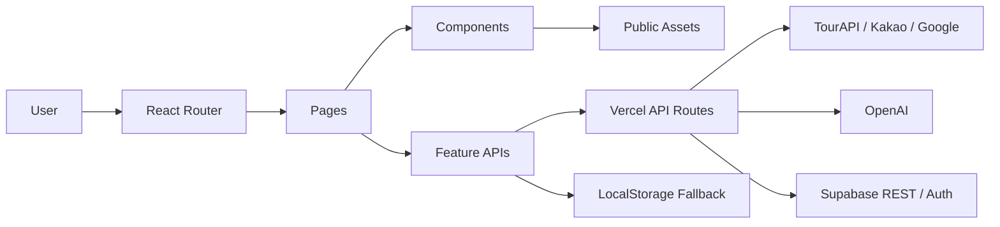

# 영주선비길

<div align="center">
  
  <br />

  ### - 영주선비길 -
  #### 선비 유형 테스트와 영주 관광 데이터를 연결하는 AI 코스 추천 플랫폼
  <br />

  <kbd>⚛ React</kbd>
  <kbd>🔷 TypeScript</kbd>
  <kbd>⚡ Vite</kbd>
  <kbd>🧭 React Router</kbd>
  <kbd>🟢 Supabase</kbd>
  <kbd>✨ OpenAI</kbd>
  <kbd>▲ Vercel Functions</kbd>
  <kbd>🗺 Kakao Map</kbd>
  <kbd>🌐 Mapbox</kbd>
  <kbd>🧊 Three.js</kbd>
</div>

<br />

## 🌐 Deployment

- Frontend: 배포 환경에서 별도 설정
- Local: `npm run dev`
- Preview: `npm run preview`
- 배포 URL, API host, 서비스 키는 저장소에 고정하지 않습니다.

<br />

## ☁️ Introduction

영주선비길은 사용자의 성향을 선비 유형으로 해석하고, 영주의 관광지와 공공 데이터를 바탕으로 맞춤형 코스와 AI 한마디를 제공하는 웹 애플리케이션입니다.

현재 저장소는 Vite React + TypeScript 기반의 웹 앱이며, 서버 기능은 `api/` 폴더의 Vercel Serverless Function으로 구성되어 있습니다. Supabase Auth, 관심 코스 저장, 한마디 기록, 익명 분석 이벤트, RAG 참고 데이터 저장을 지원합니다.

| 제품 영역 | 설명 |
| :---: | --- |
| 🧪 선비 유형 테스트 | 사용자의 답변을 바탕으로 퇴계형, 율곡형, 처사형, 우국형 결과를 제공합니다. |
| 🗺 AI 코스 추천 | TourAPI와 로컬 보강 데이터를 활용해 영주 관광 코스를 탐색합니다. |
| 🔥 관광 히트맵 | Mapbox/deck.gl 기반으로 관광 수요와 공공 데이터 레이어를 시각화합니다. |
| 🕸 AI 근거 그래프 | 추천과 판단의 근거를 그래프 형태로 확인합니다. |
| 💬 선비의 한마디 | OpenAI API와 RAG 참고 데이터를 활용해 사용자 상황에 맞는 조언을 생성합니다. |
| 🎒 마이페이지 | Supabase Auth 기반으로 관심 코스, 한마디 기록, 배지, 미션 회고를 조회합니다. |

<br />

## 🧭 Demo Scope

- `/` 경로는 서비스 랜딩 화면입니다.
- 현재 구현 범위는 웹 시연용 React 앱과 Vercel API 함수입니다.
- Expo/React Native 구조는 향후 확장 목표이며, 현재 checkout에는 `app/` Expo Router 구조가 없습니다.
- API 키가 없거나 외부 데이터 호출이 실패해도 지도, 관광 정보, 분석 이벤트는 안전한 fallback 흐름을 사용합니다.
- 실제 API 키, Supabase service role key, 관리자 비밀값은 저장소에 포함하지 않습니다.

| Route | 화면 | 주요 목적 |
| :--- | :--- | :--- |
| `/` | 홈 | 서비스 소개와 주요 기능 진입 |
| `/test` | 선비 유형 테스트 | 사용자 성향 답변 수집 |
| `/test/result` | 테스트 결과 | 선비 유형 결과와 공유 이미지 생성 |
| `/test/result/:type` | 유형별 결과 | 특정 선비 유형 결과 직접 확인 |
| `/result` | 결과 리다이렉트 | 이전 결과 URL을 `/test/result`로 연결 |
| `/course` | 추천 코스 | 관광지 목록, 상세 정보, 관심 코스 저장 |
| `/heatmap` | 관광 히트맵 | 관광 수요, 시설, 경로 관련 지도 시각화 |
| `/tour-3d` | 3D 관광 프리뷰 | Google Maps 기반 3D 코스 미리보기 |
| `/mission-complete` | 미션 완료 | 관광 미션 완료 상태 확인 |
| `/mission-complete/:placeId` | 미션 회고 | 방문 장소 기반 회고 작성 |
| `/ai-evidence-graph` | AI 근거 그래프 | 추천 근거와 키워드 연결 확인 |
| `/knowledge-graph` | AI 근거 그래프 별칭 | 기존 링크 호환용 근거 그래프 진입 |
| `/judge` | 선비의 한마디 | 텍스트/이미지 기반 AI 조언 생성 |
| `/mypage` | 마이페이지 리다이렉트 | 기본 기록 화면으로 이동 |
| `/mypage/records` | 나의 기록 | 최근 선비의 한마디 기록 조회 |
| `/mypage/one-line` | 한마디 아카이브 | 저장된 한마디와 회고 모아보기 |
| `/mypage/badges` | 배지 | 획득 배지 확인 |
| `/mypage/saved-courses` | 저장 코스 | 관심 코스 목록 조회 |
| `/login` | 로그인 | 이메일 기반 로그인 |
| `/signup` | 회원가입 | Supabase Auth 회원 가입 |
| `/forgot-password` | 비밀번호 재설정 | 계정 복구 이메일 요청 |
| `/auth/callback` | 인증 콜백 | Supabase Auth redirect 처리 |
| `/admin-login` | 관리자 로그인 | 관리자 접근 코드 기반 세션 생성 |
| `/admin` | 관리자 대시보드 | 익명 이벤트, 관심 코스, RAG 상태 요약 |

<br />

## 💻 Architecture



```text
src/
├─ app/               # React Router
├─ components/        # 공통 UI, 레이아웃, 관광 카드, 결과 카드
├─ data/              # 로컬 코스/유형 데이터
├─ features/          # auth, analytics, favorites, judge, map, tourism, rag
├─ hooks/             # 화면 모션과 reveal hook
├─ lib/               # Supabase REST helper, storage
├─ pages/             # 주요 화면 라우트
└─ styles/            # 전역 스타일

api/
├─ admin/             # 관리자 인증, 대시보드, RAG seed
├─ rag/               # RAG 검색 API
├─ tourism.ts         # TourAPI 프록시
├─ route.ts           # Kakao Mobility 경로 프록시
├─ google-route.ts    # Google Routes 프록시
├─ judge.ts           # AI 한마디 API
└─ rag-chat.ts        # AI 길잡이 챗봇 API
```

<br />

## 🛠️ Tech Stack

| Frontend | Map & Visualization | Backend/API | Data & AI |
| :---: | :---: | :---: | :---: |
| <kbd>⚛ React 19</kbd><br /><kbd>🔷 TypeScript 6</kbd><br /><kbd>⚡ Vite 8</kbd><br /><kbd>🧭 React Router 7</kbd> | <kbd>🗺 Kakao Map JS</kbd><br /><kbd>🌐 Mapbox GL</kbd><br /><kbd>📊 deck.gl</kbd><br /><kbd>🧊 Three.js</kbd> | <kbd>▲ Vercel Functions</kbd><br /><kbd>🟢 Supabase REST/Auth</kbd><br /><kbd>🟩 Node runtime</kbd> | <kbd>🏛 TourAPI</kbd><br /><kbd>🟢 Supabase PostgreSQL</kbd><br /><kbd>✨ OpenAI Chat/Embedding</kbd><br /><kbd>🧠 RAG RPC</kbd> |

- UI: React 19, CSS modules/global CSS, styled-components 일부
- Map: Kakao JavaScript SDK, Mapbox token 기반 heatmap, Google Maps 3D preview
- Auth/Data: Supabase Auth REST, `favorite_courses`, `judge_histories`, `analytics_events`
- AI: OpenAI chat completions, embedding 기반 `rag_documents` 검색
- Safety: `.env.example` placeholder, secret scan, dangerous diff harness

<br />

## 🧪 Planned Technologies

아래 항목은 현재 웹 앱을 지역 관광 AI 플랫폼으로 확장하기 위한 예정 기술입니다. 현재 checkout은 Vite React 앱이며, Expo/React Native 구조와 Supabase Edge Functions 전환은 향후 로드맵으로 관리합니다.

### Future Technical Stack

| 영역 | 후보 기술 | 적용 목적 |
| :--- | :--- | :--- |
| 모바일 앱 구조 | React Native, Expo, Expo Router | 웹 시연 흐름을 모바일 내비게이션과 권한 흐름으로 확장 |
| 지도 WebView | Kakao Map JavaScript SDK in WebView | 모바일에서 Kakao 지도 origin, URL, loading, fallback 상태를 추적 |
| API 프록시 | Supabase Edge Functions, Vercel Functions | TourAPI, Kakao Mobility, Google Routes, OpenAI 호출을 서버 전용 키로 보호 |
| 테스트 | Jest, React Testing Library, Playwright | 추천 로직, fallback 데이터, 지도 화면, 시각 회귀 확인 |
| 데이터 저장 | Supabase PostgreSQL, Storage, RLS | 관심 코스, AI 한마디, RAG 문서, 관리자 이벤트 저장 |
| 관측/운영 | Analytics events, admin dashboard, harness scripts | 실패 원인, fallback 전환, 비밀값 누출, 위험 diff 점검 |

| 예정 기술 | 활용 방향 | 산출물 |
| :--- | :--- | :--- |
| 공공데이터 프록시 | TourAPI와 지역 관광 데이터를 서버 함수에서 정규화 | 관광지 목록, 상세 정보, 추천 후보 |
| Kakao/Google 경로 연계 | 도보/차량 경로 응답을 앱에서 비교 가능한 형태로 변환 | 코스 이동 시간, 경로 preview, 지도 overlay |
| RAG 문서 검색 | 영주 관광/문화 문서를 embedding으로 검색 | AI 한마디 근거, 추천 이유, 관리자 RAG 상태 |
| 지도 fallback | 외부 SDK 실패 시 로컬 시설/관광지 목록으로 전환 | 지도 미로드 상황에서도 탐색 가능한 UI |
| 이미지 기반 조언 | 사용자 이미지 입력을 AI 한마디 판단 흐름에 연결 | 텍스트+이미지 기반 조언, 기록 저장 |

### Candidate Data Sources

| 데이터 후보 | 주요 필드/내용 | 영주선비길 활용 방식 |
| :--- | :--- | :--- |
| 한국관광공사 TourAPI | 관광지, 주소, 좌표, 이미지, 분류 코드 | 추천 코스 후보, 상세 패널, 지도 마커 |
| 공공데이터포털 | 지역 관광, 시설, 교통, 행정 데이터 | 관광 정보 보강, 관리자 검증 자료 |
| 영주시 관광/문화 자료 | 선비문화, 소수서원, 부석사, 무섬마을 등 지역 콘텐츠 | 선비 유형별 추천 맥락과 설명 문구 |
| Kakao Mobility / Kakao Map | 경로, 좌표, 장소 검색, 지도 SDK | 이동 경로, 지도 표시, 코스 접근성 참고 |
| Google Maps / Routes | 3D preview, 경로 후보, 지도 시각화 | 관광 코스 몰입형 미리보기 |
| Supabase 사용자 데이터 | 관심 코스, 한마디 기록, 배지, 익명 이벤트 | 개인화, 마이페이지, 관리자 지표 |
| 로컬 fallback 데이터 | `public/data/yeongju-enrichment.json`, 정적 이미지/아이콘 | API 실패 시에도 유지되는 관광 탐색 경험 |

### Recommendation Score Draft

| 점수 항목 | 예시 배점 | 근거 데이터 | 설명 |
| :--- | :---: | :--- | :--- |
| 선비 유형 적합도 | 25 | 테스트 결과, 유형별 테마 | 퇴계형, 율곡형, 처사형, 우국형 성향과 관광지 분위기 매칭 |
| 관광 테마 일치도 | 20 | TourAPI 분류, 로컬 보강 데이터 | 역사, 자연, 체험, 휴식 등 목적별 추천 품질 보정 |
| 이동 편의성 | 20 | Kakao/Google route, 좌표 거리 | 코스 간 이동 시간과 경로 복잡도 반영 |
| 데이터 신뢰도 | 15 | 공공데이터 응답, 로컬 fallback, 이미지 유무 | 외부 데이터와 로컬 보강 정보의 완성도 평가 |
| 사용자 맥락 | 10 | 관심 코스, 최근 기록, 미션 회고 | 저장/방문/회고 이력을 추천 사유에 반영 |
| AI 설명 가능성 | 10 | RAG 검색 결과, embedding 유사도 | 추천 이유와 선비의 한마디 근거를 사용자에게 설명 |

### MVP Roadmap

| 단계 | 실행 내용 | 검증 기준 |
| :---: | :--- | :--- |
| 1. 웹 시연 안정화 | Vite 앱의 주요 라우트, 이미지, 지도, 로그인 흐름 정리 | `npm run build`, `npm run lint`, harness 통과 |
| 2. 공공데이터 보강 | TourAPI 프록시와 로컬 영주 데이터 정규화 | API 실패 시 fallback 목록 유지 |
| 3. 지도/경로 고도화 | Kakao Map, Mapbox heatmap, Google 3D preview 상태 추적 | origin, URL, loading, fallback, error reason 기록 |
| 4. RAG 운영화 | 관리자 seed, 검색 RPC, AI 한마디 근거 연결 | RAG 문서 검색 가능성과 관리자 대시보드 지표 확인 |
| 5. Expo 전환 검토 | Expo Router 화면 구조와 WebView 지도 로딩 전략 설계 | 모바일 WebView에서 지도와 fallback 동작 검증 |
| 6. 안전 점검 자동화 | secret scan, dangerous diff, skipped test 검사 강화 | 민감키, fallback 삭제, 위험 변경을 사전 차단 |

<br />

## 📦 Required Materials

| 자료 | 위치 |
| :--- | :--- |
| GitHub 저장소 | `git remote get-url origin` |
| 실행 문서 | `README.md` |
| 패키지 정보 | `package.json` |
| 프론트엔드 소스 | `src/` |
| 서버/API 소스 | `api/` |
| 환경변수 예시 | `.env.example` |
| Supabase SQL/schema | `supabase/schema.sql` |

<br />

## 🔐 Environment Variables

`.env.example`을 참고해 로컬에서는 `.env.local`을 생성합니다. 실제 키가 들어간 `.env.local`은 커밋하지 않습니다.

```bash
cp .env.example .env.local
```

Windows PowerShell:

```powershell
Copy-Item .env.example .env.local
```

브라우저에 노출되는 값만 `VITE_` 접두사를 사용합니다. `OPENAI_API_KEY`, `TOUR_API_SERVICE_KEY`, `SUPABASE_SERVICE_ROLE_KEY`, `ADMIN_SESSION_SECRET` 등은 서버 전용 환경변수입니다.

<br />

## 🗄️ Supabase Setup

1. Supabase SQL Editor에서 `supabase/schema.sql`을 실행합니다.
2. Authentication에서 Email provider를 활성화합니다.
3. Google/Kakao 소셜 로그인을 사용할 경우 Supabase Auth redirect URL을 설정합니다.
4. 배포 환경에는 service role key를 서버 환경변수로만 등록합니다.

생성되는 주요 테이블:

| Table/RPC | 목적 |
| :--- | :--- |
| `analytics_events` | 익명 이벤트와 선택적 user id 기록 |
| `favorite_courses` | 로그인 사용자의 관심 코스 저장 |
| `judge_histories` | 로그인 사용자의 AI 한마디 기록 |
| `rag_documents` | RAG 참고 문서와 embedding 저장 |
| `match_rag_documents` | embedding 유사도 검색 RPC |

<br />

## 🚀 Getting Started

```bash
npm install
npm run dev
```

Windows PowerShell에서 실행 정책이나 shim 문제로 `npm`이 막히면 아래 명령을 사용할 수 있습니다.

```powershell
npm.cmd install
npm.cmd run dev
```

<br />

## ✅ Validation

```bash
npx tsc --noEmit
npm run lint
node scripts/harness/check-no-skipped-tests.js
node scripts/harness/check-no-secrets.js
node scripts/harness/check-dangerous-diff.js
npm run build
```

Windows에서는 필요하면 `npx.cmd`, `npm.cmd`를 사용합니다.

<br />

## 👥 Member

팀원 정보는 프로젝트 발표 자료 정리 후 업데이트합니다.

| 🧑‍💻 최현규 |
| :---: |
| Full-Stack Developer |

<br />

## 💡 Commit Convention

- **Feat**: 새로운 기능 추가
- **Fix**: 버그 수정
- **Docs**: 문서 수정
- **Style**: 포매팅, 세미콜론 누락 등 기능 변경 없는 스타일 수정
- **Refactor**: 기능 변화 없는 코드 구조 개선
- **Test**: 테스트 코드 작성 또는 수정
- **Chore**: 빌드, 설정, 패키지 매니저 등 기타 작업

<br />

## 📎 Reference

- Architecture: `docs/architecture/project-map.md`
- Auth: `docs/auth.md`
- Social login: `docs/social-login.md`
- Favorites: `docs/favorites.md`
- Judge history: `docs/judge-history.md`
- RAG: `docs/rag.md`
- Admin dashboard: `docs/admin-dashboard.md`
- Supabase schema: `supabase/schema.sql`
